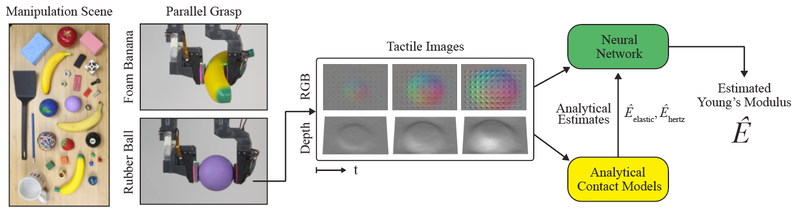
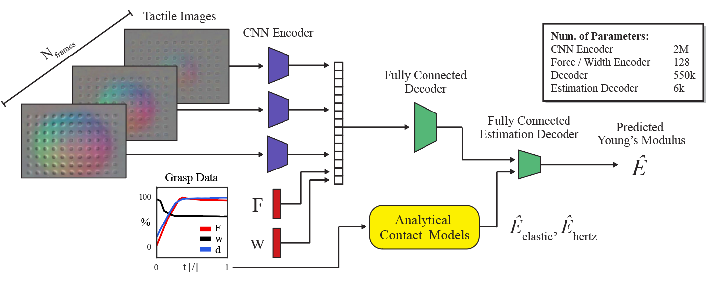

# Tactile Estimate Modulus

Dataset available on [HuggingFace](https://huggingface.co/datasets/mburgjr/GelSightYoungsModulus).

Pre-print is available on [arXiv](https://arxiv.org/abs/2406.15304).

## Description

In this project, we seek to estimate the compliance of an unknown object from a single grasp with GelSight Wedge sensors. We use analytical models alongside a data-driven approach to better generalize across both shape and material type. We parametrize compliance as Young's Modulus, which is a well-defined material property and characterizes an object's resistance to deformation in the elastic regime.

    

## Documentation

### Downloading Data

Data collected over multiple grasps for each object in our novel dataset is publicly available on [HuggingFace](https://huggingface.co/datasets/mburgjr/GelSightYoungsModulus). To properly utilize this codebase, please download the dataset and unzip `gelsight_youngs_modulus_dataset.zip` into `./data/gelsight_youngs_modulus_dataset`.

### Example Script

An example script has been written in `./estimate_from_grasp.py`. Here, you can find how to evaluate the Young's Modulus from a single grasp. We also showcase how to collect data over many grasps and retrain the model.

Main code for the project is located in `./src`. We have created modules for recording data directly from GelSight Wedge's and efficiently storing it. More importantly, you can find methods used for analytical estimations and our neural network architecture. All code could be augmented for compatibility with other camera-based tactile sensors or hardware setups.

### Architecture

Our estimation system fuses learned features from sampled tactile images with grasp data and analytical estimations. These estimations are generated using simple elastic and Hertzian models of contact with our soft sensor.

    

